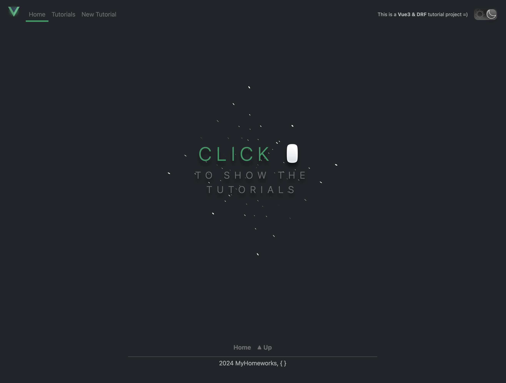
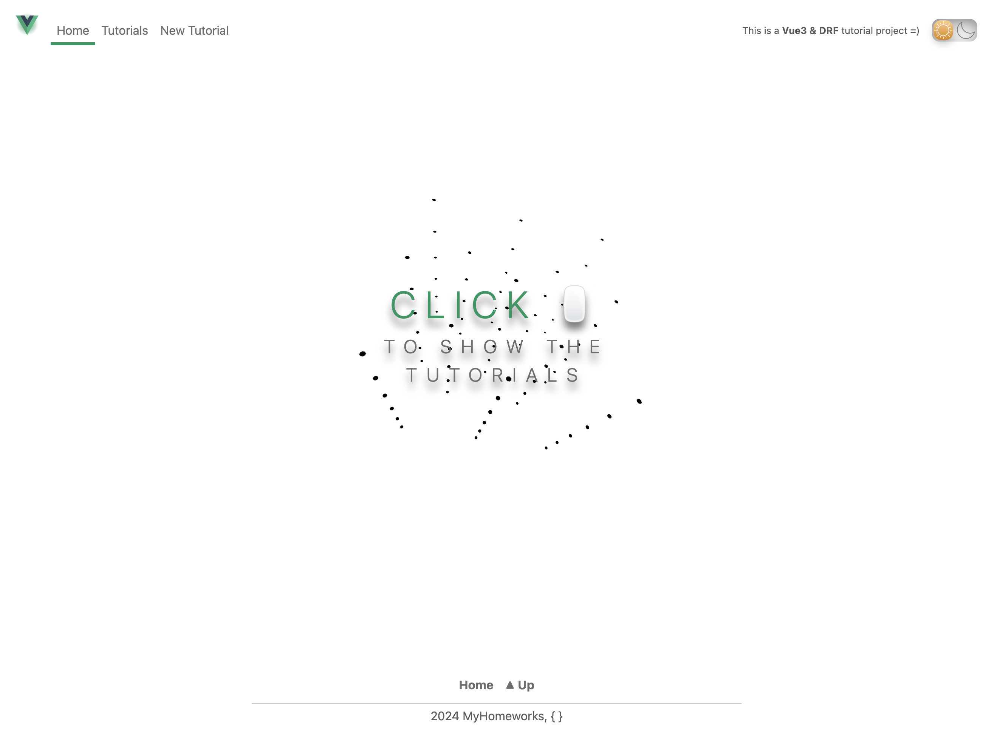
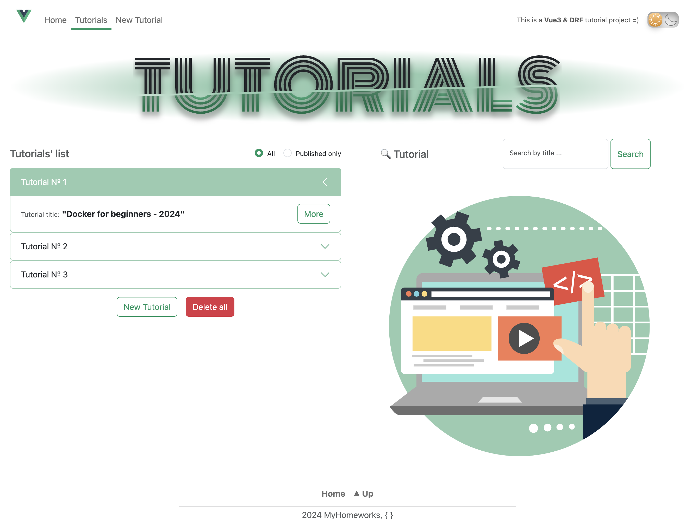
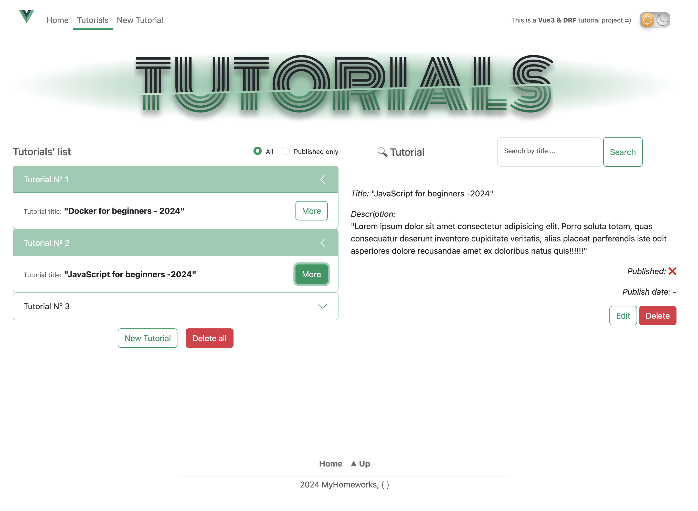
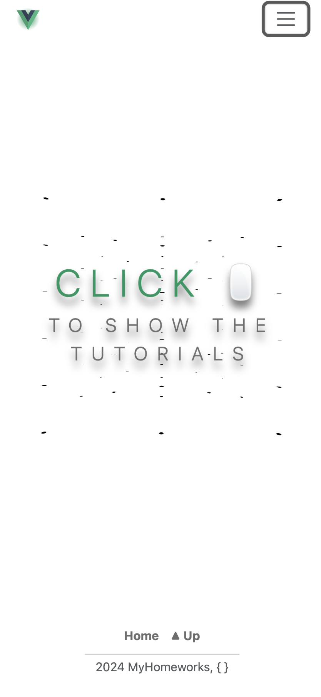
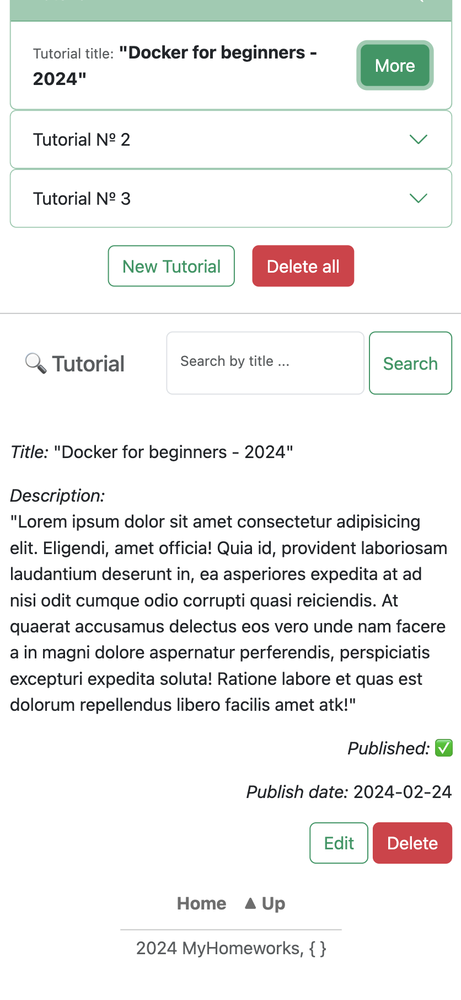

## App Description

This is a simple CRUD project **'IT_Tutorials'** that is build using:

- MySQL;
- Django Rest Framework;
- Gunicorn;
- Vue3;
- Bootstrap5;
- Webpack;
- Docker + Compose;
- NGINX;
- CSS/SCSS/HTML.

## Launch instructions

1. Clone repository/archive to your **local folder**;
2. Open Terminal and make sure You are in **local folder**:

    ```
    cd '.../local_folder'
    ```

3. Copy file dev.env and rename to .env in the same root directory:

    ```
    cp dev.env .env
    ```

4. Open and follow the instructions properly in the new created .env file;
5. For this step you should already have installed Docker and Compose on your PC. Start installation:

    ```
    docker compose up --build
    ```

- Installation can take some time, it depends on your PC resources;
- After the installation is completed, the app will start automatically on localhost:8080;
- Open app using <http://localhost:8080> in your browser;

5. The superuser (admin) has been already created;

- You can login under current superuser (admin) using <http://localhost:8080/admin> with standart credentials:

  ```
  login: admin

  pass: admin
  ```

- For password change - open **another Terminal** and enter:

   ```
   docker exec -it api sh

   python3 manage.py changepassword admin
   ```

- Create new password, confirm and then exit:

    ```
    exit
    ```

  *(close Terminal after successful password replacement)*

6. To stop the app (server):

    ```
    Ctrl + C
    ```

7. To **stop app** (stop all docker containers):

    ```
    docker compose stop
    ```

8. To **start app** (start all docker containers):

    ```
    docker compose start
    ```

9. To completely **remove** all created docker containers, images and volumes:

   ```
   docker compose down --volumes --rmi all
   ```

**p.s.:**

  ---> ./API/django_logs/ : contains **drango rest framework** error logs.

  ---> ./API/gunicorn_logs/ : contains **Gunicorn** access and error logs.

### Screenshots

1. *Main page (light & dark themes)*



  
2. *Tutorials page with content*




3. *Tutorial update form*


4. *Mobile look like*

<div align="center">
  
  
  
</div>
