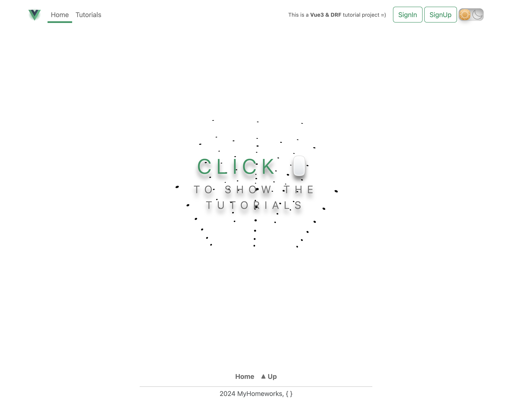
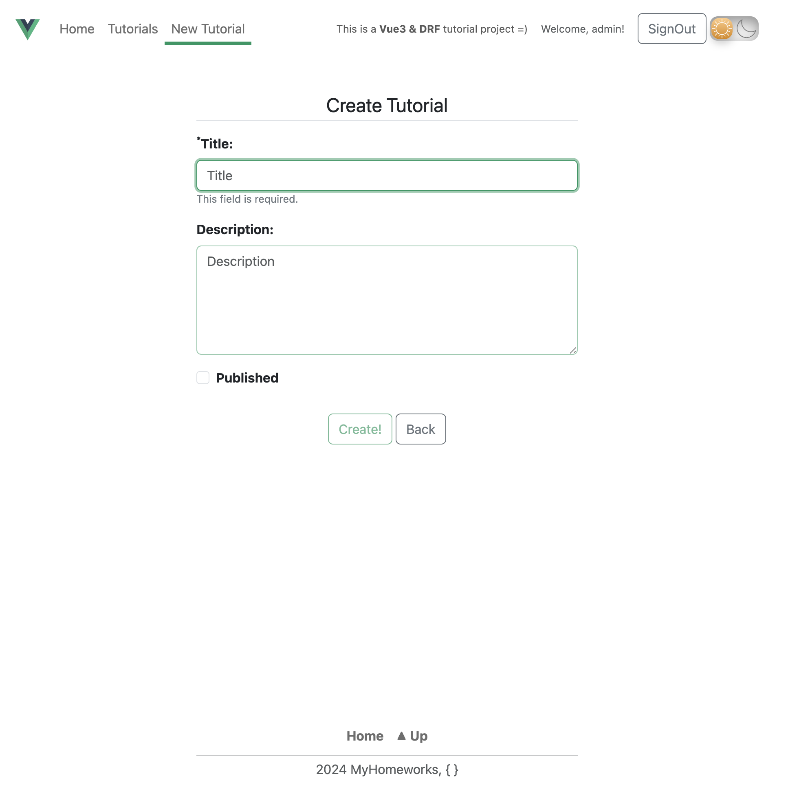
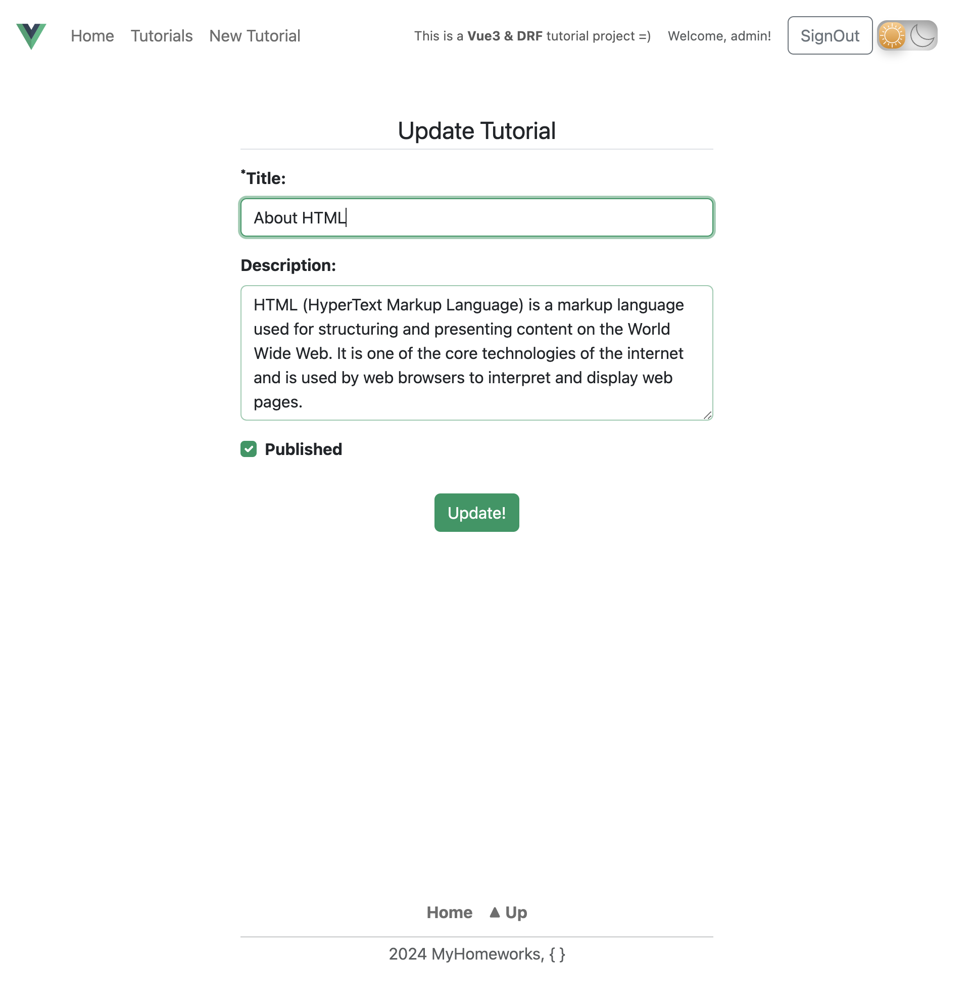

## App Description &#128209;

This is a simple CRUD project with JWT authorization based on using such technologies as: Vue3, Bootstrap5, Django Rest Framework, Webpack, PostgreSQL, NGINX and Docker.

## Launch instructions &#128190;

&#9881;**Frontend**:

- Vue3;
- Bootstrap5;
- Webpack + prettier + eslint.
  
&#9881;**Backend**:

- DRF;
- Docker;
- PostgresQL;
- NGINX;

<div style="display: flex; justify-content: end;">
  <p>Git and Docker should be installed locally on Your PC.</p>
</div>

---

1. Clone repository to Your local path:

    ```sh
    cd <your_local_path> && git clone <http/ssh-link>
    ```

2. Run compose:

    ```sh
    cd Tutorials && docker compose --env-file ./.env.public up --build    
    ```

3. After the installation is complete the web-app will start on `localhost:8080`;

- Open web-app in browser using URL: <http://localhost:8080/>

4. The superuser(admin) is NOT created automatically. To create it by yourself follow the instructions below in the new terminal (related docker containers must be in use):

    4.1 Create superuser:

    ```sh
    docker exec -it api python3 manage.py createsuperuser --noinput --username admin --email admin@example.com
    ```

    4.2 Note, that default password is already preset in the script above. So default credentials are:

    ```js
        {
          username: admin;
          email: admin@example.com;
          password: admin;
        }
    ```

    - for another password preset it should be **changed FIRST** in ./.env.public `DJANGO_SUPERUSER_PASSWORD=` and then run point 4.1 again.

    4.3 For changing already existing superuser's password (not password preset):

    ```sh
    docker exec -it server python3 manage.py changepassword admin
    ```

    - you will be prompted to set another password.

5. Stop the web-app press in current terminal:

    ```sh
    Ctrl + C
    ```

    or

    ```sh
    docker compose --env-file ./.env.public stop
    ```

6. Start again the web-app:

    ```sh
    docker compose --env-file ./.env.public start
    ```

7. To completely remove all related docker containers, docker images, volumes and related data:

    ```sh
    docker compose --env-file ./.env.public down --volumes --rmi all
    ```

    <span style="color: rgb(255, 0, 0)">After this step, it is need to go back to point №2 to run web-app again.</span>

---

### p.s

- Local environment variables can be changed in the `./.env.public`<br/>
- Outer ports of postgresql and nginx are `5433` & `8080` respectively and could not be changed via environment.
- API inner and outer ports are the same and could be changed via environment, default `8000`.

## Screenshots &#127745;

1. Main page (light & dark themes)

<div align="center">
  
  
</div>
  
2. Tutorials page with content (for no auth user)

<div align="center">
  
</div>

3. Tutorials page with content (for auth user)

<div align="center">
  
</div>

4. Tutorial create and update page

<div align="center">
  
  
</div>

5. Mobile look pages

<div align="center">
  
  
</div>

6. 404 not found page

<div align="center">
  
</div>

<br>

---
